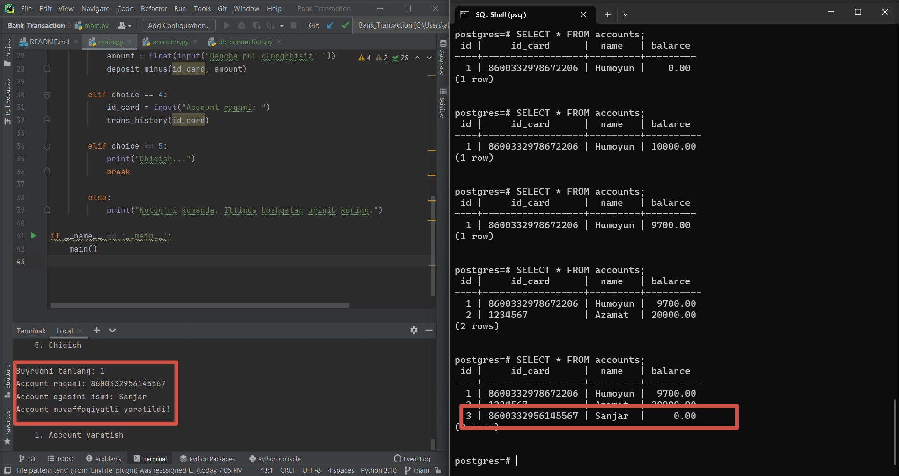

# Bank_Transaction

## Система Банковского Учета (Bank Transaction System) с использованием PostgreSQL и Psycopg2

> Система Банковского Учета - это простая программа, позволяющая пользователям создавать аккаунты, пополнять счет, снимать деньги и просматривать историю транзакций. Она использует PostgreSQL для хранения информации об аккаунтах и транзакциях, а также обеспечивает точность обновления баланса счета при пополнении и снятии денег с помощью транзакций.



**Пример программы так работает.**

## Предварительные требования

**Перед запуском программы убедитесь, что у вас установлены следующие программы:**
- Python (https://www.python.org/)
- PostgreSQL (https://www.postgresql.org/)
- Библиотека Psycopg2 (https://pypi.org/project/psycopg2/)


## Начало работы

1. Установите Python (версия 3.11.4) на ваш компьютер.

2. Клонируйте репозиторий с GitHub:
    ```bash
    $  git clone git clone  https://github.com/Humoyun004/Bank_Transaction.git
    ```
3. Перейдите в директорию с программой:
cd Bank_Transaction


## Использование
1. Как использовать
2. Запустите файл main.py для запуска Системы Банковского Учета.
3. Выберите нужное действие из меню:
    - 1: Создать аккаунт
    - 2: Пополнить счет
    - 3: Снять деньги
    - 4: Посмотреть историю транзакций
    - 5: Выйти

## Создание аккаунта

**Чтобы создать аккаунт, выберите опцию 1 из меню и укажите номер ID карты и имя владельца аккаунта. Программа создаст новый аккаунт с начальным балансом 0.**

## Пополнение счета

**Чтобы пополнить счет, выберите опцию 2 из меню и укажите номер ID карты и сумму для пополнения. Программа обновит баланс аккаунта и зарегистрирует транзакцию как пополнение.**

## Снятие денег

**Чтобы снять деньги, выберите опцию 3 из меню и укажите номер ID карты и сумму для снятия. Программа обновит баланс аккаунта, если на счете достаточно средств, и зарегистрирует транзакцию как снятие.**


## Вклад
**Если вы хотите внести свой вклад в развитие приложения "Bank Transaction", пожалуйста, следуйте этим шагам:**

1. Форкните репозиторий на GitHub.
2. Клонируйте ваш форк репозитория на локальную машину.
3. Создайте новую ветку для вашей функции или исправления ошибки.
4. Внесите изменения и сделайте коммиты с описательными сообщениями.
5. Отправьте ваши изменения в ваш форк репозитория.
6. Создайте pull request (запрос на включение) в основной репозиторий.


## Контакты
**Если у вас есть вопросы или предложения относительно приложения "Bank Transaction", пожалуйста, свяжитесь с нами по адресу humoyunakbaraliev1@gmail.com. Мы ценим ваше мнение!**


